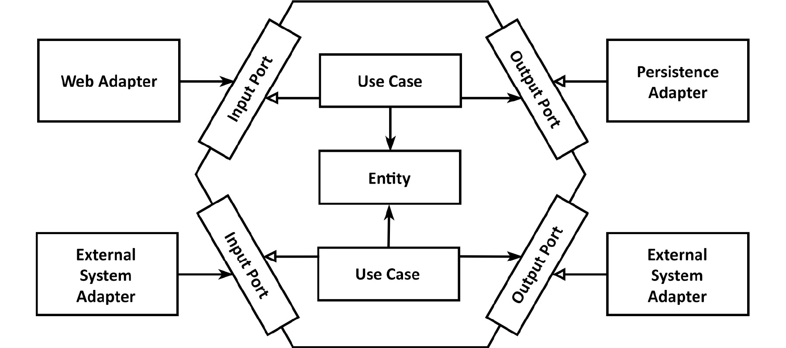

# Arquitetura Hexagonal - POC

### Sobre a arquitetura hexagonal
Também chamada de Ports and Adapters, a arquitetura hexagonal é uma forma de organizar o código em camadas, cada qual com a sua responsabilidade, tendo como objetivo isolar totalmente a lógica da aplicação do mundo externo. Este isolamento é feito por meio de Portas e Adaptadores (daí o nome Ports and Adapters), onde as Portas são as interfaces que as camadas de baixo nível expõe, e Adaptadores as implementações para as interfaces em questão (inversão de dependência)

### Sobre esta POC
A POC foi desenvolvida em Java e consiste em um projeto maven multi-módulos, sendo eles:
#### Hexagonal-poc-domain
+ Módulo responsável pelas regras de negócio da aplicação, contendo os objetos de domínio. Este módulo deve ser independente de frameworks (como spring). 

#### Hexagonal-poc-port
+ Módulo responsável por definir os contratos que serão utilizados pelos demais módulos. Trata-se das interfaces que serão implementadas pelos adapters.  

#### Hexagonal-poc-adapter
+ É neste módulo que ficam as implementações dos adaptadores. Esta camada é responsável por prover as implementações das portas, podendo-se utilizar de diversas tecnologias e frameworks. 

### Passos para compilar e testar o projeto
1. Certifique-se que esteja no diretório `hexagonal-poc-app`
2. Execute o comando a seguir para baixar as dependências do projeto, executar seus testes automatizados e compilar o mesmo: 
   `./mvnw clean package`
3. Entre no diretório que contém a aplicação rest:
   `cd hexagonal-poc-adapter`
4. Execute o comando a seguir para iniciar a execução da aplicação na porta 8080:
   `./mvnw spring-boot:run`
5. Na raíz do projeto disponibilizei o arquivo `HexagonalArch.postman_collection.json`, ele contem uma collection do Postman. Importe esta collection no Postman para testar os endpoints do serviço REST.    

